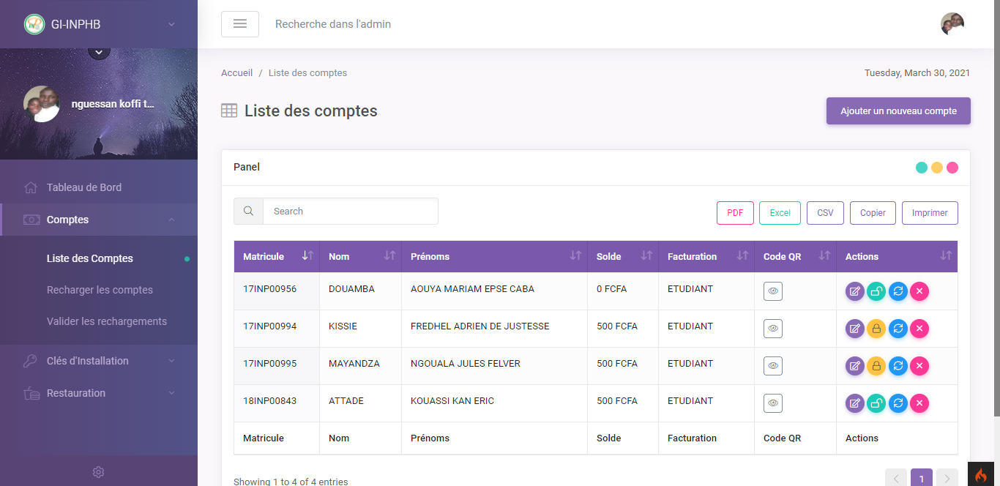

# Resto-Conso

Il s'agit d'une plateforme Web/API pour la facturation des consommations étudiantes dans les restaurants universitaires. Ce projet a été développé avec [CodeIgniter version 4](https://codeigniter.com/).




### Pré-requis

- avoir `composer` installé
- avoir `php >= 7.2` installé
- avoir `MySQL` installé

### Comment lancer le projet

Pour lancer l'application il faut : 

1- installer les dépendances :

```bash
composer install 
```


2- Mettre en place la base de données :

Copier le contenu du fichier `restauration.sql` dans votre base de données et exécuter pour installer les tables dans la base de données.

Renommer le fichier `.env.example` en `.env` et modifier le pour correspondre à votre base de données

```dotenv
#--------------------------------------------------------------------
# DATABASE
#--------------------------------------------------------------------

database.default.hostname = localhost
database.default.database = nom_de_votre_base_de_donnees
database.default.username = utilisateur
database.default.password = mot_de_passe
database.default.DBDriver = MySQLi
```

3- Lancer le serveur :

```bash
php -S localhost:8000 -t public
```

5- Ouvrir le navigateur à l'adresse http://localhost:8000
